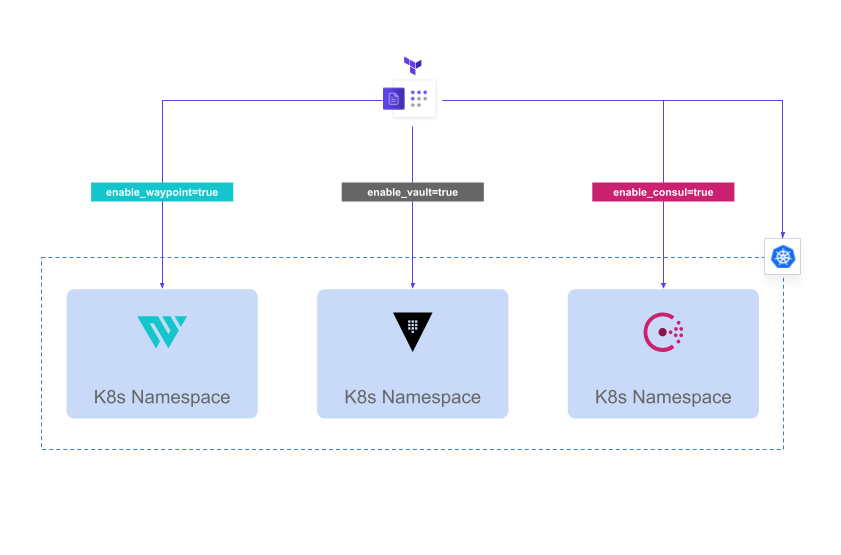

# Vault, Consul and Waypoint stack for GKE

This repository is a Terraform configuration to deploy Consul and/or Vault for demo purposes in a Kubernetes cluster in GCP (GKE). It does the following depending on the Terraform parameters configured (they are explained [later in this README](#terraform-parameters)):

* It creates a GKE cluster (you can use an existing cluster if `create_gke` terraform variable is set to `false`)
* It deploys [Consul with Helm](https://www.consul.io/docs/k8s/installation/install) and uploads the `values.yaml` to a GCS bucket 
* It deploys [Vault  with Helm](https://www.vaultproject.io/docs/platform/k8s/helm) and uploads the `values.yaml` to a GCS bucket
* It creates a `kubeconfig` file for your GKE cluster (if created) and uploads the file into the GCS bucket
* It deploys [Waypoint server](https://www.waypointproject.io/docs/server/run) using a customized `statefulSet` for K8s


## Requirements

Basically you will need Terraform and GCP permissions to create the different resources:

* Terraform 0.15+
* GCP service account with credentials:
  * GKE Admin permissions in the selected project
  * GKE KMS Admin in the selected project
* [Google Cloud API authentication](https://cloud.google.com/docs/authentication/getting-started) for your terminal 

If you have a service account with owner role you can use it for testing and demo purposes

## Terraform parameters

This Terraform configuration is parametrized with the following variables (which need to be defined in a `terraform.auto.tfvars` file or in your [Terraform Cloud variables]()):

* `gcp_region`: "The GCP region to deploy"
* `gcp_project`: "GCP project to use"
* `node_type`: "The node type and size for your K8s cluster (n1-standard-2 by default)"
* `gcp_zone`: "GCP zone for your cluster"
* `cluster_name`: "A name for your GKE cluster. This will be used also in some file names to identify your yaml files"
* `create_gke`: "Set it to false if you want to use an existing GKE cluster (default is `true`)
* `nodes`: "Number of nodes for your cluster (3 by default)
* `regional_k8s`: "If you want to use a regional GKE cluster (master per zone)"
* `owner`: "An owner name to tag some GCP resources"
* `config_bucket`: "The previously created GCS bucket to upload your file. Leave this empty ("") if you don't want to upload your Helm * values in a bucket."
* `default_gke`: "Set this to `true` if you want to use the default node pool for GKE. This speeds  GKE creation, but you won't have the * same control on the node pool at the creation stage"
* `default_network`: "Set this to `true` if you want to use 'default' network in GCP for your cluster. If `false` a network and subnetwork * will be created to host your K8s cluster nodes"
* `consul_namespace`: "The K8s namespace to deploy Consul"
* `consul_license`: "A Consul license if using Consul Enterprise"
* `consul_enterprise`: "Set this to true to deploy Consul Enterprise"
* `consul_version`: "The Consul version to deploy (e.g. '1.10.0-ent-beta2')"
* `chart_version`: "The Helm chart version to use for Consul deployment (e.g. '0.32.0-beta2')"
* `enable_consul`: "Set this to `true` to deploy Consul (by default is `true`)"
* `enable_vault`: "Set this to `true` to deploy Vault (by default is `true`)
* `gcp_service_account`: "The GCP service account to use [KMS Vault auto-unseal](https://learn.hashicorp.com/tutorials/vault/autounseal-gcp-kms?in=vault/auto-unseal)"
* `key_ring`: "The KeyRing to use for the [KMS Vault auto-unseal](https://learn.hashicorp.com/tutorials/vault/autounseal-gcp-kms?in=vault/auto-unseal)"
* `vault_version`: "Vault version to deploy. (`1.7.2_ent` is the default value)"
* `enable_waypoint`: "Set this to `true` to deploy Waypoint as a stateful set in Kubernetes (by default is `true`)"
* `waypoint_version`: "Waypoint version to deploy from the [docker container](https://hub.docker.com/r/hashicorp/waypoint/tags?page=1&ordering=last_updated) (by default `0.4.0` is used)"
* `crypto_key`: "The key name in KMS for Vault auto-unseal"
* `crypto_key`: "The key name in KMS for Vault auto-unseal"


## Deploying your cluster

First you need to initialize Terraform by:
```
$ terraform init
```

By using Terraform you will deploy the following depending on the parameters selected:



Define your variables in the `terraform.auto.tfvars` file. Bear in mind the following:

* If you want to just create a GKE cluster without deploying Vault and Consul, just set `enable_consul=false` and `enable_vault=false`. If later you want to deploy Vault and/or Consul you can use the `yaml` files uploaded to your GCS bucket (if you set it in `configure_bucket=<your_gcs_bucket_name>` to do a `helm install -f <values_file>`)
* If you want to create the GKE cluster and deploy only Vault, just use `enable_consul=false` and `enable_vault=true`
* If you want to create the GKE cluster and deploy only Consul, just use `enable_consul=true` and `enable_vault=false`
* If you want to deploy Vault and Consul after creating a GKE cluster, use `enable_consul=true` and `enable_vault=true`
* You can also deploy HashiCorp Waypoint server by `enable_waypoint=true`, mixed with the other parameters. (This is not a standard way of deploying Waypoing, but it simulates the `statefulset` Kubernetes component for the server that creates the `waypoing install -platform=kubernetes` command)
  
Ensure you are [authenticated to Google Cloud with your JSON Key file](https://cloud.google.com/docs/authentication/getting-started#setting_the_environment_variable), and then run:

```
$ terraform apply
```


### If you want to use Terraform Cloud

It is recommended to use [Terraform Cloud](https://app.terraform.io/session) instead Terraform locally, so you can take advantage of the unattended way of working with Terraform and secure your variables and configuration. 

First create Terraform remote backend from the root path of the Terraform configuration (this repo root path):

```
$ TFE_ORG=<your-organization> TFE_WORKSPACE=<workspacename> cat - << EOF > backend.tf
terraform {
  backend "remote" {
    workspaces { name = "${TFE_WORKSPACE}" }
    hostname     = "app.terraform.io"
    organization = "${TFE_ORG}"
  }
}
EOF
```

Then, init your project as usual, but now it is pointing out to the [remote backend](https://www.terraform.io/docs/language/settings/backends/remote.html) you just created:

```
$ terraform init
Initializing modules...

Initializing the backend...

Successfully configured the backend "remote"! Terraform will automatically
use this backend unless the backend configuration changes.

Initializing provider plugins...
- Reusing previous version of hashicorp/helm from the dependency lock file
- Reusing previous version of hashicorp/kubernetes from the dependency lock file
- Reusing previous version of hashicorp/google from the dependency lock file
- Reusing previous version of hashicorp/random from the dependency lock file
- Using previously-installed hashicorp/helm v2.1.2
- Using previously-installed hashicorp/kubernetes v2.2.0
- Using previously-installed hashicorp/google v3.67.0
- Using previously-installed hashicorp/random v3.1.0

Terraform has been successfully initialized!

You may now begin working with Terraform. Try running "terraform plan" to see
any changes that are required for your infrastructure. All Terraform commands
should now work.

If you ever set or change modules or backend configuration for Terraform,
rerun this command to reinitialize your working directory. If you forget, other
commands will detect it and remind you to do so if necessary.
```

## Deploying the cluster

Once you have initialized Terraform with `terraform init`, you have to apply the Terraform plan and confirm selecting `yes`:
```
$ terraform apply

...

Plan: 20 to add, 0 to change, 0 to destroy.

Changes to Outputs:
  + consul-yaml   = [
      + (known after apply),
    ]
  + consul_token  = [
      + (known after apply),
    ]
  + gke_endpoints = (known after apply)
  + kubeconfig    = (known after apply)
  + vault-yaml    = [
      + (known after apply),
    ]
  + vault_ca      = [
      + {
          + "vault.ca"  = ""
          + "vault.crt" = ""
          + "vault.key" = ""
        },
    ]

Do you want to perform these actions in workspace "hashi-k8s"?
  Terraform will perform the actions described above.
  Only 'yes' will be accepted to approve.

  Enter a value: yes

...

```

After the Terraform apply is complete you should have a terraform output with some information, like:
* Consul and Vault yaml values file url from your GCS bucket
* The Consul `bootstrap token`, so you can authenticate into Consul with an initial ACL token
* The Kubeconfig file of your GKE cluster, so you can use it to connect from any other location (useful if you want to connect from a CI/CD engine without using gcloud commands)
* GKE cluster url endpoint
* If you used certificates to use HTTPS with Vault, you will have your certificates and key in the Terraform output

You can get your outputs any time with `terraform output` command.

## Bootstrap Waypoint

> NOTE: We are not using the recommended way of installing Waypoint, which should be done by using Waypoint CLI:
> ```
> waypoint install -platform kubernetes -k8s-namespace waypoint -accept-tos
> ```
> We are deploying for simplicity in the Terraform config the StatefulSet application that any Waypoint installation should create. The difference is that there is no `Waypoint Runner` installed and that you need to bootstrap the Waypoint server after deployment.

In this configuration the Waypoint server is initialized, but not bootstrapped, so you need to do it first in the `waypoint-server-0` pod running with the following command:
```
kubectl exec -ti waypoint-server-0 -n waypoint -- waypoint server bootstrap -server-addr=[::]:9701 -server-tls-skip-verify
```

The output of that command will be the bootstrap token of Waypoint, which you can use to authenticate, so you can store it in a `WAYPOINT_SERVER_TOKEN` variable.

But let's create a Waypoint context from your terminal to connect to the server with a new waypoint token (you need to execute the previous command of bootstrapping the server if you want this to work):

```
waypoint context create -server-addr "$(kubectl get svc/waypoint -n waypoint --template="{{(index .status.loadBalancer.ingress 0).ip}}"):9701" \
-server-tls-skip-verify \
-server-require-auth \
-server-auth-token "$(kubectl exec -ti waypoint-server-0 -n waypoint -- waypoint token new | tr -d '\r')" \
mygke-context
```

You can check that your context has been created by:
```
$ waypoint context inspect mygke-context

» Context Info:
          address: 34.77.33.142:9701
              tls: true
  tls skip verify: true
     require auth: true
```

And also verify your connectivity:
```
$ waypoint context verify
✓ Context "gke-new" connected successfully.
```

## Deploy Boundary with Waypoint

I have included a Waypoint configuration in this repo to deploy Boundary in the GKE cluster:

```
$ cd waypoint-boundary

$ waypoint init

$ waypoint up
```


## TODO
... WIP...

* Add Boundary into Terraform configuration (instead of Waypoint deployment)
* Improving Terraform outputs
* Add some replication features for Vault deployment
* Add some federation features for Consul deployment
* Include the possibility to connect Consul and Vault depending on Terraform parameters